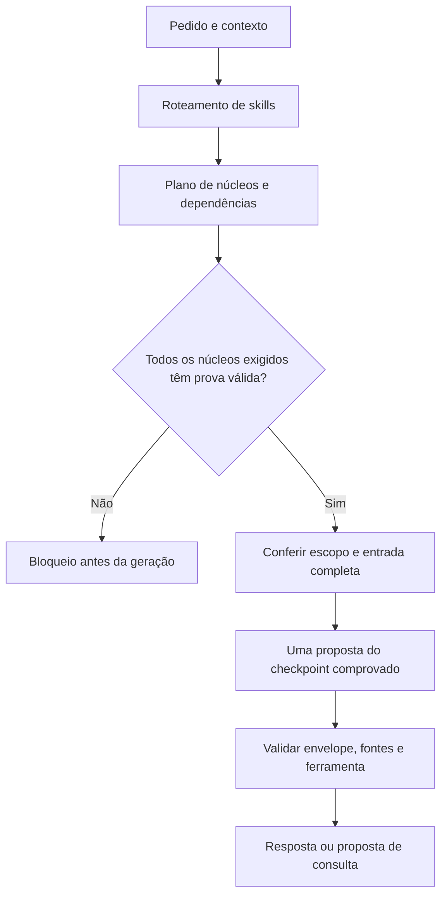

# Núcleos de habilidade e prova de competência — 01/10/2026

Ativação posterior: [o laboratório V4 e os serviços locais foram colocados em uso](ATIVACAO_MODELO_2026-10-01.md),
mantendo a reprovação e as travas descritas nesta avaliação.

Foi implementada uma divisão em **dez núcleos de execução e avaliação**, com
contratos, dependências, critérios próprios e uma trava de despacho. A V4 foi
avaliada em 288 casos novos e 264 de regressão. **Os cinco componentes medidos
reprovaram; as cinco habilidades gerais permanecem não avaliadas.** Nenhum peso
foi treinado ou promovido nesta rodada.

Essa divisão delimita responsabilidades e provas no software. Os cinco
componentes numéricos ainda compartilham o checkpoint V4; não são cinco redes
neurais treinadas separadamente. A arquitetura permite vincular provas a outros
checkpoints, mas não transforma o modelo existente em especialistas competentes
por dar nomes aos núcleos.

## Divisão e responsabilidade

| Núcleo | Responsabilidade | Prova necessária |
| --- | --- | --- |
| Formato e contratos | Envelope JSON válido e entrada completa | Todas as famílias, sem falhas de contrato |
| Extração e fontes | Valor completo, correção, referência exata e resistência à instrução injetada | Oráculo derivado das observações |
| Abstenção e conflitos | Distinguir falha, vazio, ausência e contradição de evidência suficiente | Casos de bloqueio e casos em que deve responder |
| Comparação numérica | Confirmar e rejeitar versões em relação ao mínimo | Casos positivos, negativos e igualdade |
| Argumentos de ferramentas | Escolher a consulta com caminho ou URL completos | Igualdade dos argumentos e contrato da ferramenta |
| Programação | Entrega de código funcional e integrada | Testes executados, variação inédita e integração |
| Pesquisa | Síntese sustentada por fontes pertinentes | Verificação independente das fontes e da síntese |
| Planejamento | Dependências, restrições e critérios de conclusão | Execução das etapas e observação do resultado |
| Comunicação | Coerência, revisão e manutenção do contexto | Rubrica independente e diálogos inéditos |
| Matemática | Solução e verificação além da comparação estreita de versões | Oráculo numérico ou simbólico independente |

O [catálogo](../config/cognitive_cores.json) mapeia as 17 skills existentes para
núcleos e seus contratos. O roteador devolve `core_plan`, com etapas em ordem de
dependência, estado da prova e disponibilidade de despacho. Skills novas sem
contrato ficam sem competência comprovada.

Um núcleo aprovado não cobre automaticamente os demais. Comparação depende de
formato e extração; programação depende de formato e argumentos; pesquisa
compõe formato, extração, abstenção e argumentos. A execução de ferramentas
continua sujeita aos contratos e às autorizações do runtime.

## Critérios que impedem atalhos

Os critérios foram fixados no catálogo antes da avaliação da bancada nova:

- pelo menos 24 casos em cada família, em **reservado e regressão**;
- pelo menos 90% no total e 75% em cada família, por bancada;
- pelo menos 75% dos grupos completos de estados de evidência;
- zero propostas indevidas dentro da responsabilidade medida;
- para formato, 100% de contratos válidos e pedidos preservados.

Os dois tipos de ausência — outro projeto com o campo certo e mesmo projeto
com outro campo — têm contadores e limiares separados na bancada nova.
Abstenção inclui observações, correções e injeções que exigem responder: devolver
sempre um bloqueio não aprova. Comparação exige «Sim» e «Não»: responder sempre
«Sim» também não aprova. Um JSON legível com valor errado pode contar para o
núcleo de formato, mas reprova extração ou comparação e não libera a composição.

Os estados são `passed`, `failed` e `not_evaluated`. Falta de dados de execução
não vira uma nota zero inventada nem uma aprovação. As provas numéricas não
podem aprovar programação, pesquisa, planejamento, comunicação ou matemática
geral; esses núcleos exigem outras bancadas e ainda não têm avaliadores de
entrega conectados a este certificador.

## Avaliação executada

O candidato foi fixado pelo hash e pela seleção anterior de validação, antes de
criar a nova bancada. O reservado usa seis entidades novas (`AraticP`,
`MangabaD`, `BuritiE`, `CopaibaL`, `PitangaS`, `JenipapZ`), números em uma faixa
nova de seis dígitos e as duas variantes de ausência. As entidades são disjuntas
dos dados de treino, validação e reservado da V4 e da bancada de regressão V3.
As famílias e os formatos de tarefa são familiares ao treino: a novidade não
comprova transferência a tarefas gerais.

O arquivo de inferência não contém respostas autorais, `reference_decision`,
`messages` de SFT nem rótulos de cópia. O oráculo deriva o resultado do pedido e
das observações, sem participar da geração. Houve uma proposta por caso, sem
ferramentas ao vivo, receitas de resposta ou correção dos textos produzidos.
Todos os 552 pedidos foram preservados no decoder.

| Núcleo medido | Reservado novo | Regressão V3 | Estado |
| --- | ---: | ---: | --- |
| Formato e contratos | 224/288 | 195/264 | Reprovado |
| Extração e fontes | 46/72 | 21/72 | Reprovado |
| Abstenção, decisões e referências | 156/192 | 117/168 | Reprovado |
| Comparação numérica | 24/48 | 24/48 | Reprovado |
| Argumentos de ferramentas | 15/48 | 13/48 | Reprovado |

Os contadores se sobrepõem e medem responsabilidades diferentes; não devem ser
somados. O total de decisões completas foi **175/288** na bancada nova e
**116/264** na regressão, com respectivamente **48 e 77 propostas indevidas**.
São conjuntos diferentes dos 288 casos V4 da rodada anterior; 175 não deve ser
apresentado como ganho sobre 168 sem uma comparação nos mesmos pedidos.

Na bancada nova, extração teve 21 propostas indevidas. Abstenção teve três
respostas propostas quando deveria bloquear; seu escore considera decisão,
referências e razão do bloqueio, sem reivindicar acerto do valor. Comparação
acertou todos os 24 positivos e errou todos os 24 negativos em ambas as bancadas.
Argumentos acertou seis caminhos e nove URLs no reservado. O zero de propostas
de `answer` indevidas nesse último núcleo não implica consultas corretas.

Essas medidas orientam treinos por responsabilidade: formato falha sobretudo em
consultas; extração precisa preservar a origem diante de distrações e injeções;
abstenção precisa recuperar conflitos; comparação precisa aprender os dois
sentidos; argumentos precisam copiar trechos completos e fechar o envelope.
Outra tentativa de treino deverá reservar uma prova nova antes de avaliar, pois
os casos desta rodada agora são conhecidos.

## Provas e integração ao serviço

A prova vincula checkpoint, metadados, tokenizer, catálogo, protocolo, dados,
relatórios, scripts, implementação e contratos de `read_file` e `open_page`.
O verificador reavalia os textos com o oráculo e recalcula os estados; não aceita
uma nota ou `passed: true` sem reproduzir os resultados. Mudanças em pesos,
tokenizer, código, contratos ou dados invalidam o vínculo. Provas duplicadas para
o mesmo checkpoint são tratadas como ambíguas, sem escolher a mais favorável.
O cache só reutiliza uma verificação quando os artefatos continuam iguais.

As APIs do worker Python são:

- `GET /v1/cognition/cores`: estado dos núcleos para o checkpoint carregado e
  resultados dos candidatos avaliados;
- `GET /v1/agent/capabilities`: inclui `cognitive_cores`;
- `POST /v1/skills/route`: inclui `core_plan` na rota existente;
- `POST /v1/cognition/cores/decide`: despacho explícito, bloqueado antes de gerar
  se os núcleos e dependências não tiverem competência comprovada.

O despacho deriva os núcleos exigidos da tarefa. O cliente não pode solicitar
somente formato para evitar a prova de comparação ou extração. Declarar
competência, enviar um certificado no pedido ou solicitar fallback não libera
execução. Após a prova, o pedido ainda deve caber integralmente no contexto e
respeitar a interface numérica medida: um turno, até três observações de arquivo,
sem histórico adicional ou restrições não avaliadas. A validação de escopo não
calcula a resposta.

O estado do checkpoint ativo permanece **não avaliado por este protocolo**.
A prova da V4 não pode ser emprestada ao modelo ativo. O despacho novo não executa
ferramentas nem promove pesos. O caminho geral anterior de conversa e execução
continua separado: a trava implementada é do despacho explícito de núcleos,
não uma certificação retroativa de todos os caminhos antigos. Não houve reinício
do serviço nesta rodada; as novas APIs ficam disponíveis ao carregar o código
atualizado.

## Artefatos e reprodução

- [Protocolo congelado antes da avaliação](../datasets/cognitive_core_qualification_v1/protocol.json)
- [288 entradas reservadas, sem respostas de treino](../datasets/cognitive_core_qualification_v1/reserved.jsonl)
- [Geração e avaliação reservada](../model/cognitive-cores/v1/reserved.json)
- [Geração e avaliação de regressão](../model/cognitive-cores/v1/regression.json)
- [Prova por núcleo e hashes](../model/cognitive-cores/v1/evidence-03.json)
- [Índice de provas do serviço](../model/cognitive-cores/registry.json)
- [Estado auditado do candidato e do checkpoint ativo](../model/cognitive-cores/v1/status.json)
- [Registro final da verificação](../model/cognitive-cores/v1/audit.json)

Os dois primeiros certificados (`evidence.json`, `evidence-02.json`) foram
preservados, mas não constam do índice atual: as travas de escopo e composição
foram reforçadas depois de sua criação. Seus hashes de código já não representam
a implementação final; `evidence-03.json` é o artefato vigente.

A verificação final aprovou **199 testes e 211 subtestes**, cobrindo roteamento,
contratos, dependências, adulteração de provas, troca dos pesos/tokenizer/código,
dados de treino modificados, argumentos, escopo e ausência de fallback. As
fixtures positivas desses testes são artificiais e identificadas como testes de
software; não entram nas provas do modelo. Um teste Go inicialmente falhou por
tentar escrever no cache fora da área permitida. Ele passou com
`GOCACHE=/tmp/ia-local-cores-go-cache`, e a bateria completa foi repetida nesse
ambiente com sucesso.

Para avaliar outro candidato, fixe pesos, catálogo e dados em um protocolo novo,
sem selecionar pelo reservado. Depois execute o avaliador nas duas bancadas e
use `scripts/certify_cognitive_cores.py --protocol ... --reserved-report ...
--regression-report ... --output ...`. O certificador recusa sobrescrever provas.
Termina com código 1 quando há núcleo reprovado ou não avaliado; os relatórios
continuam gravados para inspeção. A criação do relatório não ativa o candidato.
