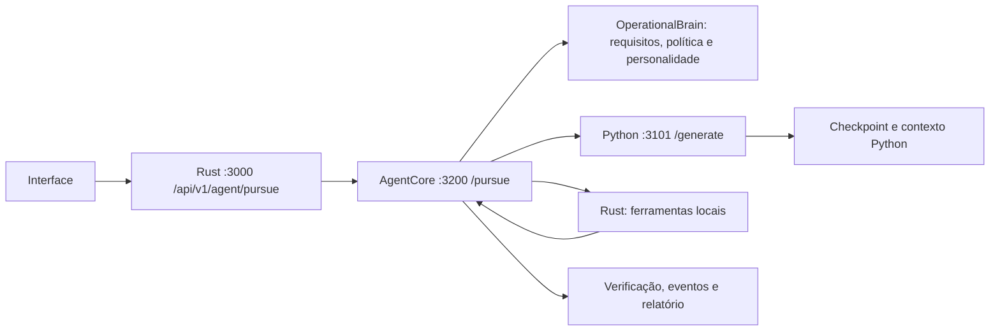

# Plano de APIs do cérebro e da personalidade

## Objetivo

Fazer a conversa, o entendimento do pedido, a memória, a personalidade, o planejador e a execução compartilharem um único contexto de tarefa. A decisão semântica fica no AgentCore TypeScript; o serviço Python fornece geração e recuperação local; o runtime Rust continua sendo a porta para as ferramentas e o workspace. Todo tráfego entre esses componentes permanece em `127.0.0.1`; o fluxo não depende de Ollama, de modelos remotos ou de APIs externas.

## Estado da implementação — 29/09/2026

As rotas e contratos principais desta proposta foram implementados e conectados. O diagnóstico abaixo registra as lacunas encontradas antes desta etapa.

## Diagnóstico antes da implementação

O caminho principal já existe:



- `POST /api/v1/agent/pursue` encaminha ao AgentCore, que controla plano, aprovações e execução.
- `GET /api/v1/agent/tasks`, `GET /api/v1/agent/tasks/{id}` e `GET /api/v1/agent/tasks/{id}/workflow` já fornecem consulta da tarefa e seu progresso.
- O endpoint de contexto inicialmente devolvia apenas `agent-context/v1` e não era chamado como uma porta do AgentCore. Agora aceita `agent-context-request/v2` e devolve `agent-context/v2`; pedidos legados continuam recebendo v1.
- `POST /api/v1/dialogue/turn` serve a conversa do checkpoint. `POST /generate` serve ao planejador, mas usa um envelope de mensagens, objetivo e orientação procedural; requisitos, personalidade e critérios de aceite não possuem um contrato cognitivo próprio.
- `CognitiveBrain.recordClarification` existe internamente, mas não há uma rota pública para responder a uma pendência cognitiva. A retomada pública existente atende aprovação de escrita.

## Contratos a introduzir

### 1. Pedido normalizado `agent-request/v2`

Compartilhado por `understand` e `pursue`; o cliente continua escrevendo em linguagem natural.

```json
{
  "schema": "agent-request/v2",
  "request_id": "req-82",
  "operation_id": "agent-core-82",
  "conversation_id": "chat-14",
  "prompt": "Crie um sistema web para acompanhar entregas da equipe.",
  "objective": "auto",
  "workspace_root": "/projetos/entregas",
  "history": [],
  "preferences": {"language": "pt-BR", "stack": null},
  "preparation_id": null
}
```

`objective: auto` é o padrão no contrato v2. Preferências são fatos declarados pela pessoa; ausência de stack permite ao cérebro inspecionar os manifestos locais do workspace. O cliente não envia regras de personalidade, permissões ou alegações de capacidade.

O contrato público usa `snake_case`; o parser do AgentCore normaliza os campos para os nomes internos TypeScript. O gateway Rust encaminha o JSON sem alterar o contrato.

### 2. Preparação cognitiva `agent-understanding/v1`

Saída de uma operação sem escrita. A mesma função interna prepara também toda chamada de `pursue`.

```json
{
  "schema": "agent-understanding/v1",
  "preparation_id": "prep-local-51",
  "status": "ready",
  "objective": "build",
  "interpretation": "Aplicação web para acompanhar entregas de uma equipe.",
  "personality": {"mode": "interface", "version": "local-personality/v1"},
  "assumptions": [{"key": "stack", "value": "stack observada no workspace", "source": "workspace"}],
  "constraints": [],
  "acceptance_criteria": ["Exibir e atualizar o andamento das entregas", "Passar as verificações do projeto"],
  "questions": [],
  "next_step": "Inspecionar o fluxo existente e propor a primeira alteração integrada.",
  "capabilities": {"available": ["read_file", "edit_file", "project_checks"], "approval_required_for_writes": true}
}
```

`status` aceita `ready` ou `clarifying`. Perguntas devem ser poucas e só aparecer quando a resposta mudar materialmente o comportamento, o risco ou o escopo. O contrato expõe resumo, premissas, modo e próximo passo; nunca raciocínio privado passo a passo.

### 3. Execução `agent-report/v2`

`POST /api/v1/agent/pursue` permanece a rota principal e devolve `agent-report/v2` com o resumo cognitivo. Se receber `preparation_id`, o AgentCore reutiliza a preparação apenas quando ela corresponde ao mesmo pedido, conversa, workspace, histórico, anexos e preferências; caso contrário, recalcula e informa `expired_or_request_mismatch`.

O `pursue` comum também pode calcular a preparação internamente, então a interface não precisa fazer uma chamada extra para tarefas diretas. `/understand` serve a prévia de premissas e perguntas quando a pessoa ou a interface quiser revisar antes de executar.

### 4. Retomada discriminada `agent-resume/v1`

`POST /api/v1/agent/tasks/{task_id}/resume` cobre respostas de esclarecimento e decisões de aprovação sem reiniciar a identidade da tarefa.

Resposta a uma pergunta:

```json
{"schema":"agent-resume/v1","kind":"clarification","answers":["A equipe tem até 12 entregas ativas."]}
```

Decisão sobre escrita:

```json
{"schema":"agent-resume/v1","kind":"approval","action_id":"action-93","decision":"approve"}
```

Cada retomada é idempotente por `request_id`, validada contra o estado persistido e limitada à pendência da tarefa. A forma atual de retomar com `approved: true` fica como adaptador de compatibilidade até os clientes migrarem.

### 5. Contexto recuperado `agent-context/v2`

`/api/v1/agent/context` e `/v1/agent/context` agora aceitam a porta somente de leitura chamada pelo cérebro. Ela devolve histórico resumido, memória relevante, skills e evidências locais com proveniência, confiança e limites. Não decide objetivo, modo de personalidade, permissão ou próxima ferramenta. A resposta v2 usa identificador/versão do perfil, sem copiar o texto completo `assistant_profile`.

O AgentCore combina esse contexto com inspeção e análise de requisitos, preserva origem (`user`, `workspace`, `memory`, `inferred`) e passa ao planejador apenas o subconjunto pertinente.

### 6. Decisão do planejador `agent-plan-request/v1`

`POST /v1/agent/plan` nomeia o papel do planejador; há também `/v1/agent/plan/stream`. O pedido contém `task_id`, `objective`, interpretação, modo e versão da personalidade, premissas, critérios de aceite, ferramentas disponíveis e contexto relevante. Mantém as mensagens necessárias ao checkpoint, mas trata texto recuperado como dado, nunca como instrução.

O planejador só propõe uma chamada de ferramenta ou uma resposta final. O AgentCore valida schema, escopo, risco e política; o runtime Rust executa; o resultado observado volta ao planejador para a próxima etapa. `/generate` permanece como adaptador temporário. `workflow_guidance` também permanece compatível durante a migração e depois é convertido em orientação tipada com proveniência.

## Rotas propostas e responsáveis

| Rota pública local | Situação | Responsável |
|---|---|---|
| `POST /api/v1/agent/understand` | Implementada, prévia sem escrita de arquivos/memória | Rust encaminha; AgentCore prepara e consulta contexto local |
| `POST /api/v1/agent/pursue` | Implementada para v2; mantém o formato camelCase legado | AgentCore controla o ciclo completo |
| `POST /api/v1/agent/tasks/{id}/resume` | Implementada para esclarecimento, aprovação e rejeição | AgentCore restaura a pendência persistida e valida a ação |
| `GET /api/v1/agent/tasks` e `GET /api/v1/agent/tasks/{id}` | Existentes, manter | AgentCore devolve estado, eventos e relatório |
| `POST /api/v1/agent/context` | Implementada; aceita v2 e preserva v1 legado | Python devolve contexto local com proveniência |
| `POST /v1/agent/plan` e `/v1/agent/plan/stream` | Implementadas; `/generate` fica compatível | Python produz proposta para validação do AgentCore |
| `POST /api/v1/dialogue/turn` | Existente, manter sem execução de ferramentas | Python gera respostas conversacionais pelo checkpoint próprio |

## Regras de integração

1. O AgentCore é dono do `task_id`, objetivo final, estado, política, aprovações e critérios de aceite.
2. A personalidade é derivada automaticamente do pedido e do objetivo; a resposta inclui apenas `mode` e `version`. O texto de orientação não vem do cliente.
3. Contexto Python é recuperação; não pode substituir restrições confirmadas nem autorizar ferramentas.
4. Toda API entre componentes usa loopback, contratos versionados e limites de corpo/itens. Escrita sempre passa pela política e pela aprovação atual.
5. Erros de serviço local, contexto ausente ou checkpoint indisponível retornam estado pendente/bloqueado com evidência. Nunca são convertidos em sucesso aparente.
6. Eventos continuam associados ao mesmo `task_id` e `operation_id`, com cursor de sequência para retomada após reconexão.

## Ordem de implementação

1. [x] Definir validadores para `agent-request/v2`, `agent-understanding/v1`, `agent-context/v2`, `agent-resume/v1` e `agent-plan-request/v1`.
2. [x] Expor `understand` no AgentCore e no runtime Rust; reutilizar `OperationalBrain.prepare()` no percurso de execução.
3. [x] Conectar `ContextPort` loopback e evoluir o contexto Python, preservando o adaptador legado.
4. [x] Persistir pendências de esclarecimento/aprovação e resultados idempotentes de retomada.
5. [x] Adicionar `/v1/agent/plan` e streaming, passar contexto/cognição e validar propostas no AgentCore.
6. [x] Atualizar OpenAPI e documentação do runtime.

## Critérios de aceite

- Pedido natural com objetivo claro e stack ausente segue adiante com escolha local explícita; não pergunta por detalhes já inferíveis.
- Pedido de interface escolhe `mode: interface`, produz critérios visuais e funcionais, e não altera o workspace durante `understand`.
- Ambiguidade essencial retorna perguntas; a resposta retoma o mesmo `task_id` e vira restrição confirmada.
- Propostas do planejador não executam diretamente; cada escrita respeita aprovação, escopo e política do AgentCore.
- Contexto preserva origem, confiança e limites; evidências e anexos não podem injetar instruções.
- O ciclo completo é verificável por eventos, consulta de tarefa e resultado de testes; nenhum passo depende de Ollama, serviço remoto ou API externa.
