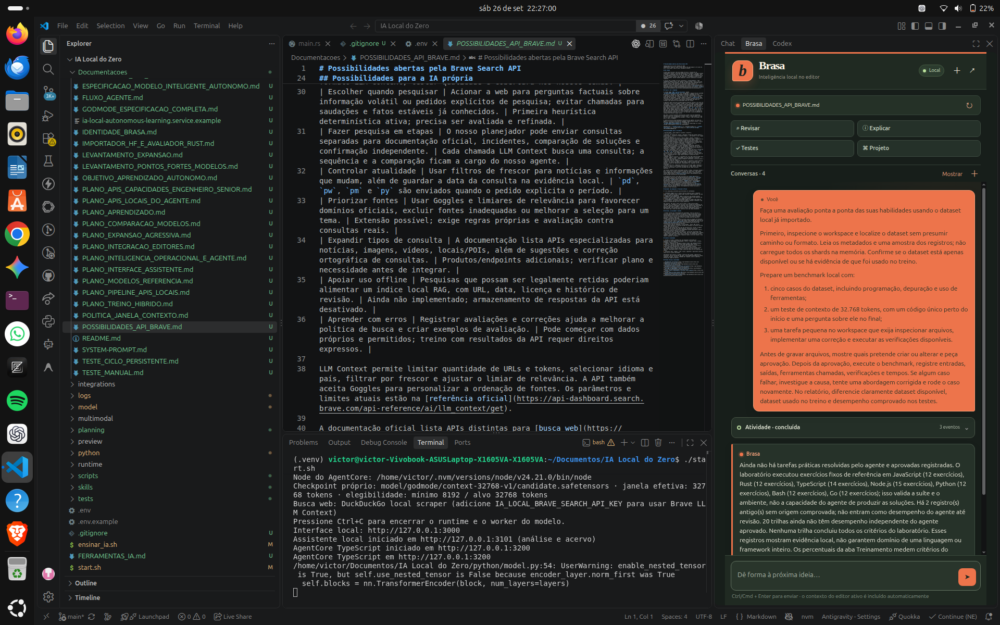

# Possibilidades abertas pela Brave Search API

**Atualizado em:** 26 de setembro de 2026  
**Objetivo:** registrar como a Brave Search API pode ampliar a IA Local do Zero, preservando a geração pelo checkpoint próprio.

## Em resumo

A Brave pode funcionar como uma camada de busca e recuperação de conhecimento recente. O principal ganho para este projeto é entregar páginas e trechos já preparados para uso por um modelo, com URLs e metadados, para que o checkpoint próprio faça a síntese. Isso pode reduzir a dependência de um dataset factual enorme, mas não substitui o treinamento necessário para entender pedidos, decidir quando pesquisar, avaliar evidências e escrever respostas.

O recurso mais alinhado com essa arquitetura é **LLM Context**. A API **Answers** também existe, mas redige a resposta usando o serviço de IA da Brave e exige o plano Answers; ela não faz parte do fluxo planejado para a IA Local do Zero, que deve manter a geração no modelo próprio. A documentação da Brave descreve essa diferença entre contexto extraído para o modelo do cliente e respostas produzidas pela Answers ([LLM Context](https://api-dashboard.search.brave.com/documentation/services/llm-context), [Answers](https://api-dashboard.search.brave.com/documentation/services/answers)).

## O que já está integrado

O runtime chama `POST /res/v1/llm/context` quando `IA_LOCAL_BRAVE_SEARCH_API_KEY` está configurada. A requisição está ajustada para Brasil e português, com SafeSearch moderado, metadados de fonte, orçamento de contexto de 4.096 tokens e parâmetros que pedem até cinco URLs, 1.024 tokens por URL, 24 trechos e seis por URL. Títulos, URLs e trechos extraídos são associados às fontes usadas na resposta. `research_web` pode reutilizar o contexto recuperado. A Brave atualiza o pipeline de extração e a interpretação dos limites; os parâmetros configurados não devem ser tratados como garantia de uma quantidade exata de trechos.

O AgentCore agora direciona automaticamente perguntas factuais com sinais de informação volátil — por exemplo, versão, preço, lançamento, clima ou termos como “hoje”, “atual” e “mais recente” — para pesquisa web, mantendo pedidos de diagnóstico e análise do workspace nos fluxos próprios. Para consultas que dizem explicitamente “hoje”, “esta semana”, “este mês” ou “este ano”, a busca envia o filtro de frescor correspondente (`pd`, `pw`, `pm` ou `py`) à Brave. Esses códigos significam páginas com até 24 horas, 7 dias, 31 dias ou 365 dias; são janelas móveis de idade, não limites de calendário. Sem um período explícito, não aplica um filtro temporal arbitrário. A resposta do fluxo de pesquisa registra se o filtro foi aplicado; a busca DuckDuckGo de fallback não oferece o mesmo filtro.

Sem chave, a busca existente continua pelo scraper local do DuckDuckGo. Quando a chave está configurada e a Brave falha, o runtime expõe o erro em vez de trocar silenciosamente de provedor. A chave é lida no servidor; não deve ir para o navegador.

O conteúdo bruto da Brave permanece transitório por padrão. Os traces do agente e o histórico persistido do navegador removem esses trechos. A opção de gravar resultados no acervo está bloqueada sem `IA_LOCAL_BRAVE_ALLOW_STORAGE=true`, e só deve ser habilitada se o plano conceder expressamente direitos de armazenamento.

Implementação: [`runtime/src/main.rs`](../runtime/src/main.rs), [`runtime/static/app.js`](../runtime/static/app.js) e [guia da API de diálogo](API_DIALOGO_HIBRIDA.md).

## Possibilidades para a IA própria

| Possibilidade | Como ajudaria o projeto | Situação |
| --- | --- | --- |
| Responder com informação recente | Recuperar trechos de páginas atuais e anexar fontes à resposta do checkpoint próprio. | LLM Context já está ligado ao fluxo de busca. |
| Consultar documentação técnica | Buscar código, tabelas, esquemas e conteúdo extraído sem precisar baixar novamente cada página. | Disponível no formato LLM Context; testar qualidade e cobertura nos nossos temas. |
| Escolher quando pesquisar | Acionar a web para perguntas factuais sobre informação volátil ou pedidos explícitos de pesquisa; evitar chamadas para saudações e fatos estáveis já conhecidos. | Primeira heurística determinística ativa; precisa ser avaliada e refinada. |
| Fazer pesquisa em etapas | O nosso planejador pode enviar consultas separadas para documentação oficial, incidentes, comparação de soluções e confirmação independente. | Cada chamada LLM Context busca uma consulta; a sequência e a comparação ficam a cargo do nosso agente. |
| Controlar atualidade | Usar filtros de frescor para notícias e informações que mudam, além de guardar a data da consulta na evidência local. | `pd`, `pw`, `pm` e `py` são enviados quando o pedido explicita o período. |
| Priorizar fontes | Usar Goggles e limiares de relevância para favorecer domínios oficiais, excluir fontes inadequadas ou melhorar a seleção para um tema. | Extensão possível; exige regras próprias e avaliação contra consultas reais. |
| Expandir tipos de consulta | A documentação lista APIs especializadas para notícias, imagens, vídeos, locais/POIs, além de sugestões e correção ortográfica de consultas. | Produtos/endpoints adicionais; verificar plano e necessidade antes de integrar. |
| Apoiar uso offline | Pesquisas que possam ser legalmente retidas poderiam alimentar um índice local RAG, com URL, data, licença e histórico de revisão. | Ainda não implementado; armazenamento de respostas da API está desativado. |
| Aprender com erros | Registrar avaliações e correções ajuda a melhorar a política de busca e criar exemplos de avaliação. | Pode começar com dados próprios e permitidos; treino com resultados da API requer direitos expressos. |

LLM Context permite limitar quantidade de URLs e tokens, selecionar idioma e país, filtrar por frescor e ajustar o limiar de relevância. A API também aceita Goggles para personalizar a ordenação de fontes. Os parâmetros e limites atuais estão na [referência oficial](https://api-dashboard.search.brave.com/api-reference/ai/llm_context/get).

A documentação oficial lista APIs distintas para [busca web](https://api-dashboard.search.brave.com/app/documentation/web-search), [notícias](https://api-dashboard.search.brave.com/app/documentation/news-search/get-started), [vídeos](https://api-dashboard.search.brave.com/app/documentation/video-search/responses), [imagens](https://api-dashboard.search.brave.com/documentation/services/image-search) e [locais/POIs](https://api-dashboard.search.brave.com/documentation/services/place-search), além de sugestões e correção ortográfica no [catálogo de recursos](https://api-dashboard.search.brave.com/documentation/resources/skills). Elas são opções futuras, não dependências necessárias para a primeira versão funcional.

## Aprender com pesquisas e funcionar offline

Há três mecanismos diferentes que não devem ser confundidos:

1. **Contexto temporário:** a Brave retorna evidências para a pergunta atual. Isso atualiza o que o modelo pode consultar naquele momento, mas não altera os pesos do checkpoint.
2. **Memória local pesquisável (RAG):** materiais que possamos guardar entram num índice local. Depois, a IA consegue recuperar esse material sem internet; deve indicar a fonte e a idade do conteúdo.
3. **Treinamento:** exemplos selecionados podem ser usados numa etapa de treino posterior, com avaliação antes de promover qualquer checkpoint. Uma pesquisa isolada não deve virar treino automático.

Sem internet, não haverá busca nova na Brave. O modo offline poderá responder com o checkpoint e com um acervo local formado por documentos do usuário, materiais licenciados e conteúdos cuja retenção seja autorizada. A aplicação deve indicar quando o acervo local não basta ou pode estar desatualizado. Isso oferece uma forma de manter conhecimento reutilizável sem assumir que a chave de busca autoriza criar uma cópia permanente.

## Direitos, privacidade e limites

- A Brave informa que armazenamento de resultados, total ou parcial — inclusive para treinar ou ajustar um modelo — exige um plano que conceda explicitamente esses direitos. Os termos gerais também restringem cache, criação de bases e uso dos resultados para treinar ou melhorar modelos. Confirmar o direito específico no plano contratado antes de persistir qualquer resultado ou derivado.
- A assinatura da API não transfere direitos sobre as páginas de terceiros. A autorização para acessar e usar cada página ainda depende das condições do respectivo editor. Veja a [FAQ oficial](https://brave.com/search/api/) e os [termos atuais da Search API](https://api-dashboard.search.brave.com/documentation/resources/terms-of-service).
- As consultas saem do computador e são enviadas à Brave. Não incluir chaves, dados pessoais ou conteúdo privado do workspace na consulta sem uma decisão explícita do usuário.
- Encontrar uma página não prova que uma afirmação está correta. O agente precisa mostrar de onde veio cada evidência, diferenciar fatos de inferências, procurar confirmação independente quando apropriado e admitir quando não encontrou material suficiente.
- O conteúdo da web é entrada não confiável: instruções encontradas numa página devem ser tratadas como texto citado, não como comandos para o agente.
- Cada consulta pode acrescentar custo e latência. O runtime deve limitar chamadas, respeitar cotas, tratar respostas vazias e erros de limite, e não repetir pesquisas sem motivo.

## Caminho recomendado

1. Validar a primeira chamada real com perguntas controladas de documentação, atualidade e ambiguidade; conferir resposta, URLs, trechos, metadados, custo e latência.
2. Comparar respostas do checkpoint próprio **com e sem contexto Brave**, medindo se as afirmações importantes estão apoiadas pelas fontes.
3. Melhorar a decisão de busca, a formação das consultas e a seleção de fontes; priorizar documentação oficial para perguntas técnicas.
4. Só então projetar uma fila de curadoria para o acervo offline. A fila deve guardar conteúdo apenas quando os direitos aplicáveis permitirem, registrar fonte/data/licença e exigir avaliação antes de virar material de treino.
5. Considerar News, imagens, vídeo, locais, sugestões e spellcheck conforme casos de uso e plano contratado.

Indicadores para avaliar as etapas: relevância das fontes, cobertura de afirmações, taxa de afirmações sem apoio, diversidade/autoridade das fontes, respostas corretas, latência, chamadas por resposta, custo e cobertura offline por idade do material.

## Fontes oficiais consultadas

- [Documentação LLM Context](https://api-dashboard.search.brave.com/documentation/services/llm-context)
- [Referência LLM Context](https://api-dashboard.search.brave.com/api-reference/ai/llm_context/get)
- [Documentação Answers e distinção de LLM Context](https://api-dashboard.search.brave.com/documentation/services/answers)
- [Catálogo de capacidades e skills da Search API](https://api-dashboard.search.brave.com/documentation/resources/skills)
- [Planos, FAQ de armazenamento e direitos sobre páginas](https://brave.com/search/api/)
- [Termos atuais da Brave Search API](https://api-dashboard.search.brave.com/documentation/resources/terms-of-service)
- [Autenticação e proteção da chave](https://api-dashboard.search.brave.com/documentation/guides/authentication)
