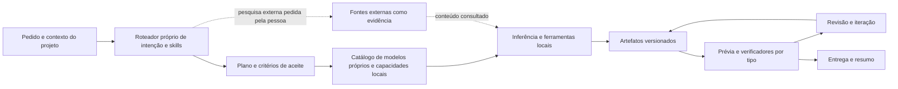

# Visão: ecossistema de IA da ideia à entrega

**Estado:** direção de produto e roteiro inicial  
**Objetivo:** ampliar a IA Local do Zero para um ambiente de criação e trabalho que não dependa de programação como porta de entrada.

## Visão

A pessoa descreve o que quer alcançar. A IA ajuda a entender o problema, explorar ideias, planejar uma solução, produzir artefatos, visualizar o resultado, receber ajustes e organizar a entrega. Programar continua sendo uma capacidade importante, mas passa a ser uma especialidade dentro de um ecossistema mais amplo.

Esse ecossistema deve apoiar, gradualmente:

- criar e comparar ideias, conceitos e planos;
- planejar interfaces e fluxos antes de implementar;
- escrever, revisar e organizar documentação e conteúdo;
- sugerir melhorias com base no objetivo e no contexto do projeto;
- gerar ou transformar imagens quando houver um mecanismo disponível;
- renderizar prévias de interfaces e outros artefatos compatíveis;
- combinar essas saídas num projeto que possa ser continuado e revisado.

O fluxo principal é:

```text
objetivo -> entendimento -> opções -> plano -> artefato -> prévia/revisão
         -> iteração -> entrega
```

Nem todo pedido precisa percorrer todas as etapas. Uma pergunta pode receber uma resposta direta; um pedido criativo pode começar com opções; uma mudança de projeto pode exigir plano, artefato e verificação.

## Princípios do produto

1. **Começar pelo objetivo da pessoa.** A interface não deve exigir que ela saiba nomes de ferramentas, linguagens ou modelos.
2. **Tratar resultados como artefatos.** Uma página, imagem, documento, roteiro ou plano precisa poder ser aberto, revisado, versionado e relacionado ao projeto.
3. **Manter criação e conversa no mesmo fluxo.** A pessoa pode pedir uma proposta, ver o resultado e iterar sem reconstruir o contexto a cada mensagem.
4. **Dar uma apresentação adequada a cada resultado.** Código abre no editor; páginas abrem em prévia; imagens aparecem na galeria; documentos ficam editáveis; pesquisas exibem fontes.
5. **Manter a geração sob controle do projeto.** Texto, ideias, imagens e outras saídas generativas vêm dos modelos e recursos desenvolvidos e executados pela própria IA Local do Zero. A geração não é terceirizada para Ollama nem para APIs de outros modelos. Pesquisa externa, quando solicitada, fornece fontes e evidências; a resposta continua sendo produzida localmente.
6. **Separar proposta de ação.** Uma sugestão não altera arquivos por si só. Mudanças no projeto mostram o que será criado ou alterado, com revisão e autorização conforme a política existente.
7. **Avaliar cada especialidade pelo resultado.** Qualidade de código, clareza de documentação, utilidade de ideias e fidelidade de uma prévia precisam de critérios próprios.

## Áreas de trabalho

| Área | O que a IA entrega | Como a pessoa avalia |
| --- | --- | --- |
| Ideias e planejamento | conceitos, alternativas, requisitos, prioridades e próximos passos | variedade útil, aderência ao objetivo e clareza das escolhas |
| Interfaces | fluxos, estrutura de telas, componentes e protótipos navegáveis | prévia renderizada, acessibilidade e aderência aos requisitos |
| Documentos e conteúdo | documentação, propostas, textos, roteiros e materiais estruturados | precisão, organização, tom e facilidade de edição |
| Imagens e mídia | imagens geradas ou transformadas pelos modelos próprios; prévias vetoriais e HTML feitas localmente | aderência ao briefing, qualidade visual e proveniência do modelo ou renderizador local |
| Programação | código, integração, correção e validação de projetos | diff, verificações disponíveis e funcionamento demonstrável |
| Pesquisa e sugestões | evidências, comparações, recomendações e lacunas identificadas | fontes, atualidade, justificativa e separação entre fato e inferência |

Essas áreas podem ser combinadas. Por exemplo, um pedido para lançar uma página pode produzir um resumo do público, opções de direção visual, uma página pré-visualizável, texto de apresentação e uma lista de melhorias.

## Modelo de trabalho: projeto e artefatos

O projeto funciona como contexto persistente. Nele ficam o objetivo, as preferências relevantes, os arquivos autorizados, as decisões e as tarefas em andamento.

Cada saída editável deve ser representada como um artefato com, no mínimo:

- identificador e tipo, como `idea`, `plan`, `document`, `image`, `interface` ou `code`;
- título, resumo e ligação ao projeto e à tarefa que o originou;
- conteúdo ou referência ao arquivo gerado;
- versão e relação com artefatos anteriores;
- estado de prévia e verificações aplicáveis;
- fontes consultadas e modelo ou renderizador próprio usado, quando aplicável;
- estado de revisão: proposta, em edição, aceita ou descartada.

O mesmo modelo deve permitir mostrar uma prévia sem esconder o conteúdo editável. A pessoa pode comparar versões, pedir uma mudança e entender o que mudou. Artefatos não devem ser salvos permanentemente em locais fora do projeto sem uma escolha explícita.

## Arquitetura do ecossistema



As responsabilidades ficam separadas:

- **Experiência de trabalho:** conversa, projeto, painel de artefatos, editor e prévia.
- **Orquestração:** interpreta intenção, seleciona skills, planeja etapas e acompanha tarefas.
- **Catálogo de capacidades:** declara contratos, disponibilidade, limites, riscos e verificadores dos recursos próprios e das ferramentas locais.
- **Modelos e ferramentas próprios:** executam operações de texto, imagem, visão, áudio, renderização e código. A disponibilidade depende da implementação local. Fontes externas só entram como evidência de uma pesquisa pedida pela pessoa.
- **Artefatos:** preservam conteúdo, versões, fontes e relação com a tarefa.
- **Qualidade:** aplica verificações adequadas a cada tipo e devolve o resultado à pessoa antes da entrega.

## Como aproveitar a base atual

| Base existente | Papel no ecossistema | Trabalho que ainda falta consolidar |
| --- | --- | --- |
| `runtime/` e `agent-core/` | execução de ferramentas e coordenação de tarefas | usar o mesmo catálogo e ciclo para pedidos criativos, documentais e visuais |
| `capabilities/metadata.json` e `skills/manifest.json` | registrar capacidades e especialidades | declarar capacidades não ligadas a engenharia, disponibilidade local e verificadores por tipo |
| Interface em `runtime/static/` | conversa, workspace, editor, cartões de resultado e prévia | apresentar ideias, documentos, imagens e interfaces como artefatos no mesmo fluxo |
| `create_web_page` e `iframe` de prévia | ponto de partida para protótipos de interface | ligar briefing, proposta, renderização, revisão e versões num ciclo coeso |
| Pack `documents` | leitura local de formatos documentais | completar criação e edição como artefatos, com exportação e revisão |
| Packs `vision`, `audio`, `video` e `generation` | estrutura para capacidades multimodais | desenvolver e conectar modelos próprios, informando disponibilidade sem prometer capacidade não instalada |
| Pesquisa Brave e acervo local | fatos atuais e evidências com fontes | apresentar a pesquisa como apoio a decisões e propostas, preservando proveniência e direitos |

O [plano da interface](PLANO_INTERFACE_ASSISTENTE.md), o [plano de expansão](PLANO_EXPANSAO_AGRESSIVA.md), o [portfólio de APIs e skills](../planning/PLANO_PORTFOLIO_APIS_E_SKILLS.md), o [plano de multimodalidade e capacidades](PLANO_APIS_CAPACIDADES_ENGENHEIRO_SENIOR.md) e o [documento da Brave](POSSIBILIDADES_API_BRAVE.md) continuam sendo especificações de suas áreas. Esta visão organiza a direção compartilhada entre elas.

## Roteiro incremental

### Marco 0 — conversa local confiável

Antes de ampliar as especialidades, o chat precisa acompanhar pedidos em linguagem natural e preservar a intenção ao longo dos turnos. Esta etapa usa apenas o modelo próprio, o roteador local, o histórico da sessão e ferramentas já disponíveis.

O trabalho cobre quatro pontos: reconhecer perguntas, opiniões, propostas e pedidos de execução; usar mensagens anteriores sem fazer a pessoa repetir contexto; encaminhar ações explícitas às ferramentas locais; e responder com clareza quando o modelo ou uma capacidade não tiver evidência suficiente.

O primeiro incremento amplia o perfil do assistente para conversa e criação em geral e reconhece propostas formuladas como “eu acho que”, “na minha visão” e “para mim”. A evolução deve transformar desvios observados em casos de avaliação revisados, sem usar conversas privadas como dados de treino por padrão.

Critérios de acompanhamento: a resposta aborda a intenção principal; referências curtas recuperam o contexto correto; uma proposta não vira código sem pedido; ações explícitas chegam à ferramenta adequada; e limites são explicados sem encerrar a conversa com uma recusa vaga. Roteamento e qualidade da resposta são avaliados separadamente.

### Marco 1 — estúdio de artefatos na interface existente

Unificar a apresentação de resultados como artefatos no fluxo atual. Um artefato tem título, tipo, resumo, conteúdo editável ou arquivo associado, ações de revisar e uma prévia quando aplicável.

**Primeiro incremento conectado:** o atalho de interface abre uma conversa guiada com três direções visuais; cada direção pode iniciar a criação no workspace, a prévia oferece ações para pedir sugestões ou descrever um ajuste, e os templates locais variam a paleta conforme a direção escolhida. O gerador ainda usa layouts locais predefinidos; composição e conteúdo realmente gerados pelo modelo são uma evolução deste marco.

**Primeiro fluxo vertical: ideia para protótipo de interface.**

1. A pessoa descreve uma página ou experiência que quer criar.
2. A IA devolve uma síntese do objetivo e algumas direções possíveis.
3. A pessoa escolhe ou ajusta uma direção.
4. A IA produz uma primeira interface com prévia renderizada.
5. A pessoa pede mudanças em linguagem natural e compara a versão atualizada.
6. O projeto mostra os arquivos e alterações antes de aplicar ou guardar a entrega.

Esse fluxo aproveita o criador de páginas e a prévia existentes e exercita planejamento, criação, renderização e iteração de ponta a ponta.

### Marco 2 — documentos e planejamento como artefatos

Permitir transformar uma ideia ou pesquisa em brief, especificação, documentação, roteiro ou checklist editável. Manter referências e decisões ligadas ao artefato e permitir revisar uma seção sem perder o restante do contexto.

### Marco 3 — criação visual conectável

Adicionar geração e transformação de imagem por meio de um modelo próprio e de capacidades tipadas. O catálogo deve mostrar se o modelo está instalado e quais limites se aplicam. Enquanto não houver um gerador próprio conectado, a IA pode criar briefings e prévias locais em SVG, HTML e CSS, sem encaminhar a geração a outro serviço.

### Marco 4 — projetos compostos

Relacionar artefatos de tipos diferentes: pesquisa que apoia uma ideia, ideia que origina uma interface, interface acompanhada por documentação e imagens. Permitir retomar o trabalho e ver versões e decisões relevantes.

### Marco 5 — packs de especialidade

Expandir por domínios conforme demanda: escrita, comunicação, organização, análise de dados, educação e criação multimídia. Cada pack acrescenta skills, capacidades, templates e avaliações, sem transformar o produto num conjunto de botões desconectados.

## Critérios para o primeiro fluxo

O marco de ideia para protótipo está pronto quando uma pessoa consegue:

- começar por uma descrição em linguagem natural;
- compreender a proposta antes de aceitar uma direção;
- ver uma prévia renderizada do resultado;
- solicitar mudanças e comparar a nova versão com a anterior;
- localizar o conteúdo editável e entender quais arquivos serão alterados;
- saber quando uma etapa depende de capacidade local indisponível ou de uma fonte externa solicitada para pesquisa.

As avaliações devem medir conclusão do fluxo, aderência ao briefing, funcionamento da prévia, acessibilidade básica, utilidade das sugestões, número de iterações e latência. Opinião da pessoa deve complementar os verificadores automáticos nos aspectos visuais e criativos.

## Direção imediata

O primeiro incremento do Marco 1 já conecta ideia, escolha visual e prévia no ambiente existente. A prioridade seguinte é o Marco 0: tornar o chat mais atento à intenção e à continuidade, usando exclusivamente o modelo próprio e recursos locais. Depois, a conversa confiável deve sustentar protótipos mais fiéis ao briefing e iterações ligadas a diffs revisáveis.
